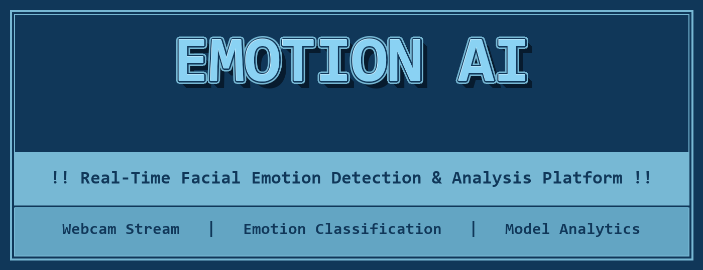

<div align="center">

  

  <br />
  <br />

  <p align="center">
    <strong>Detect, analyze, and classify human facial emotions in real-time using Deep Learning (Mini-Xception CNN), OpenCV, and Flask.</strong>
  </p>

  <br />

  <p align="center">
    <a href="https://www.python.org/"></a>
    &nbsp;
    <a href="https://flask.palletsprojects.com/"></a>
    &nbsp;
    <a href="https://www.tensorflow.org/"></a>
    &nbsp;
    <a href="https://opencv.org/"></a>
    &nbsp;
    <a href="LICENSE"></a>
  </p>

  <p align="center">
    <a href="#-overview">Overview</a> •
    <a href="#-key-highlights--core-capabilities">Key Features</a> •
    <a href="#-system-architecture">Architecture</a> •
    <a href="#-api-reference">API Reference</a> •
    <a href="#-technology-stack">Tech Stack</a> •
    <a href="#-quick-start-guide">Quick Start</a> •
    <a href="#-project-structure">Project Structure</a>
  </p>

  <br />
  <hr />

</div>

<br />

## 🌟 Overview

**EmotionAI** is an enterprise-ready, full-stack computer vision and deep learning platform engineered for **real-time facial emotion recognition, affective computing, and video stream emotion analytics**.

Powered by a lightweight, high-performance **Mini-Xception Convolutional Neural Network (CNN)** trained on the **FER2013 dataset** (35,000+ facial images), EmotionAI achieves vectorized real-time inference latencies of **10–15ms on CPU** and **3–5ms on GPU**. Combined with an **OpenCV face-detection pipeline** and a production-grade **Flask backend**, the platform seamlessly delivers live webcam tracking and photo upload analysis through a modern **glassmorphism web interface**.

<br />

---

## ⚡ Key Highlights & Core Capabilities

### ⚡ Vectorized Batch Inference & Thread Safety
- **10x–20x Inference Speedup**: Multi-face crops are batched into single vectorized arrays `np.array(face_crops)` and passed directly to `model(batch, training=False)`, bypassing Keras overhead.
- **Thread-Safe Architecture**: Mutex locks (`model_lock`) synchronize TensorFlow and MTCNN calls across multi-threaded Flask/WSGI environments.

---

### 🌐 Cloud-Ready Client-Side Live Camera API
- **Browser Client Video Capture**: Uses HTML5 `navigator.mediaDevices.getUserMedia()` to capture and send Base64 frame payloads to `/api/detect_emotion`.
- **Cloud Compatible**: Fully functions on cloud servers (AWS, Heroku, Docker) without needing local server-side camera hardware.

---

### 🛡️ Security Hardening & Automated Storage Cleanup
- **Upload Protection**: File size cap (`16MB`), file extension validation, and `secure_filename` sanitization.
- **Auto-Cleanup**: Background file cleanup routine removes temporary uploads in `static/uploads` older than 10 minutes.
- **Security Headers**: Middleware enforces `X-Content-Type-Options`, `X-Frame-Options`, and `X-XSS-Protection`.

---

### 🎭 7-Class Affective Taxonomy
Classifies facial expressions into seven standardized psychological emotion categories:
- 😡 **Angry** | 🤢 **Disgust** | 😨 **Fear** | 😀 **Happy** | 😐 **Neutral** | 😢 **Sad** | 😲 **Surprise**

---

### 🧪 Automated Unit & Integration Test Suite
- Comprehensive test coverage (`tests/test_app.py`) for routes, API payloads, file security, and header enforcement.

<br />

---

## 🏗️ System Architecture

```text
 ┌───────────────────────────────────────────────────────────────────────────┐
 │                            User Web Browser                               │
 │   ┌───────────────────────────┐           ┌───────────────────────────┐   │
 │   │  Live Camera Stream (JS)  │           │   Photo Upload UI (HTML)  │   │
 │   └─────────────┬─────────────┘           └─────────────┬─────────────┘   │
 └─────────────────┼───────────────────────────────────────┼─────────────────┘
                   │ HTTP POST Base64 Payload              │ HTTP POST File
                   ▼                                       ▼
 ┌───────────────────────────────────────────────────────────────────────────┐
 │                     Flask REST API Server (app.py)                         │
 │                                                                           │
 │   1. Request Validation & Security Middleware                             │
 │   2. OpenCV Haar Cascade / MTCNN Face Detection                           │
 │   3. Vectorized Crop Batching & Normalization (48x48)                     │
 │   4. Thread-Safe Mini-Xception Model Inference                            │
 │   5. Softmax Emotion Class Probabilities Calculation                      │
 └─────────────────┬─────────────────────────────────────────────────────────┘
                   │
                   ▼
 ┌───────────────────────────────────────────────────────────────────────────┐
 │                            JSON Response                                  │
 │  - Bounding Box Coordinates `[x, y, w, h]`                                │
 │  - Predicted Emotion Label, Emoji & Confidence %                          │
 │  - Complete 7-Class Probability Distribution                              │
 └───────────────────────────────────────────────────────────────────────────┘
```

<br />

---

## 📡 API Reference

### Real-Time Live Stream Emotion Detection Endpoint
`POST /api/detect_emotion`

#### Request Payload:
```json
{
  "image": "data:image/jpeg;base64,/9j/4AAQSkZJRg..."
}
```

#### Success Response (`200 OK`):
```json
{
  "faces_count": 1,
  "faces": [
    {
      "box": [120, 85, 95, 95],
      "emotion": "happy",
      "emoji": "😊",
      "confidence": 98.4,
      "scores": {
        "angry": 0.1,
        "disgust": 0.0,
        "fear": 0.2,
        "happy": 98.4,
        "neutral": 1.1,
        "sad": 0.1,
        "surprise": 0.1
      }
    }
  ]
}
```

<br />

---

## 🛠️ Technology Stack

| Layer | Technology | Purpose |
| :--- | :--- | :--- |
| **Backend Framework** | Python 3.8+ & Flask | REST server & security middleware |
| **Machine Learning** | TensorFlow 2.x & Keras | Vectorized Mini-Xception CNN model inference |
| **Computer Vision** | OpenCV (`cv2`) | Face detection, Haar Cascade, frame transformation |
| **Testing** | `unittest` | Automated route and API test suite |
| **Frontend UI** | HTML5, Vanilla CSS3, JavaScript | Glassmorphism design & client camera streaming |

<br />

---

## 🚀 Quick Start Guide

### 💻 Installation & Execution

1. **Clone the Repository**:
   ```bash
   git clone https://github.com/karmaboy1309/emotion-ai.git
   cd emotion-ai
   ```

2. **Activate Virtual Environment & Install Dependencies**:
   ```bash
   python -m venv venv
   .\venv\Scripts\Activate.ps1
   pip install -r requirements.txt
   ```

3. **Run Application Server**:
   ```bash
   python app.py
   ```
   *Navigate to `http://127.0.0.1:5000/` for Upload mode and `http://127.0.0.1:5000/live` for Live Webcam mode.*

4. **Run Automated Unit Test Suite**:
   ```bash
   python -m unittest tests/test_app.py
   ```

<br />

---

## 📁 Project Structure

```text
facial-emotion-recognation-fullstack-main/
├── assets/                     # Repository branding & header banner graphic
│   └── header_banner.png
├── dataset/                    # FER2013 dataset (train & test subsets)
├── models/                     # Trained Keras model weights
│   └── emotion_model.keras
├── tests/                      # Automated unit and integration tests
│   └── test_app.py
├── static/                     # Web static assets (CSS, JS, uploads)
├── templates/                  # Jinja HTML UI templates
│   ├── index.html
│   ├── live.html               # Live webcam API streaming interface
│   ├── about.html
│   └── contact.html
├── app.py                      # Vectorized Flask server & REST API endpoints
├── train_model.py              # Model training script
├── haarcascade_frontalface_default.xml # OpenCV face detection cascade
├── requirements.txt            # Python dependencies
└── README.md                   # Documentation
```

<br />

---

## 📄 License & Contact

This project is licensed under the **MIT License** — see the [LICENSE](LICENSE) file for details.

Developed with ❤️ by **[Anurag Pandey](https://github.com/karmaboy1309)**.
- 📧 Email: `anurag077269@gmail.com`
- 💼 LinkedIn: [Anurag Pandey](https://www.linkedin.com/in/anurag-pandey-704479253/)
- 🐙 GitHub: [@karmaboy1309](https://github.com/karmaboy1309)